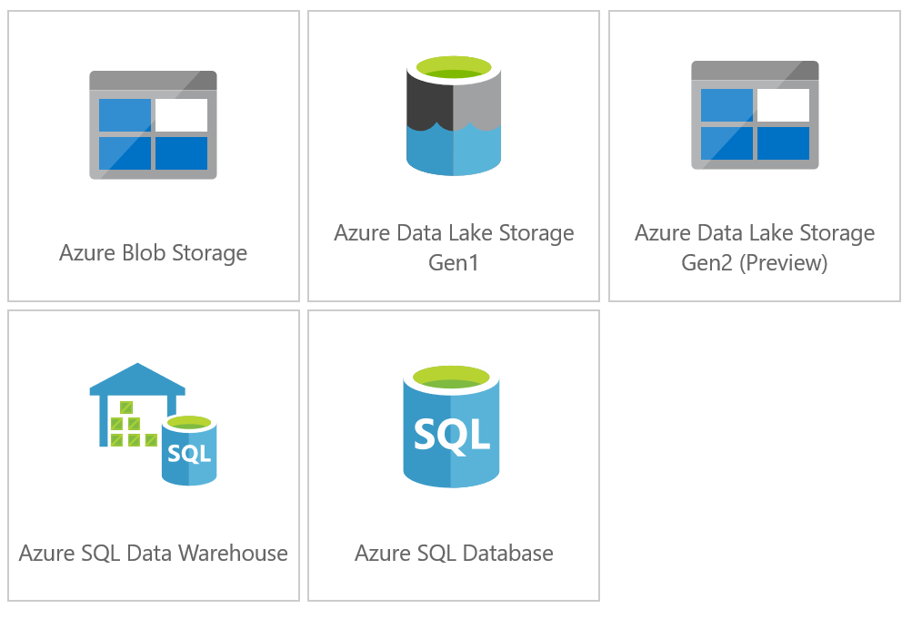
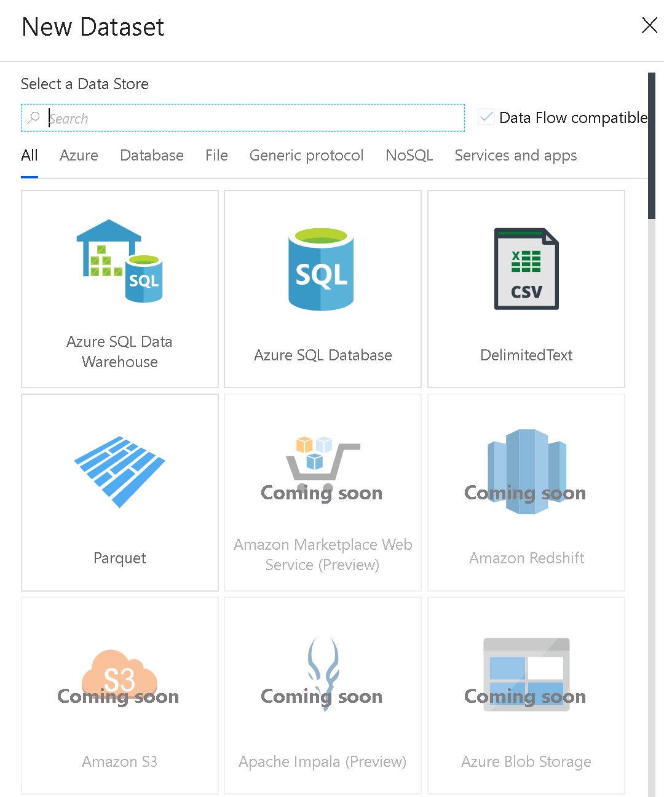

# Datasets are an ADF construct that define the data that you are working with in your pipeline.

In Data Flow, row & column level data requires a much more finely-grained definition than is required by Datasets within ADF pipeline control flow requirements.

Therefore, you use ADF Datasets in Source & Sink transforms to define the basic data schema (if you have schema in your data, otherwise you do not load schema and use Schema Drift), data types, data formats, location and connection (as part of the associated Linked Service).

## ADF Preview Service for Data Flows

There are currently 5 direct connectors available to you in Data Flow:

1. ADLS Gen 1 (MSI & AKV authentication not currently supported)
2. ADLS Gen 2
3. Blob Storage
4. Azure SQL DB
5. Azure SQL DW

Data flow in ADF is built upon the premise that you will stage your data for transformation in Spark. Therefore, if your source data is not located in one of those above listed stores, or you are required to sink your data into a destination not listed there, use the Copy Activity after your Data Flow Activity in an ADF Pipeline to then move your data into your final sink, or to stage the data from the other 70+ ADF connectors via Copy into one of the above supported staging stores.

**NOTE: Not all properties from the Data Set definitions in ADF are currently honored by Data Flow. The UI will make an attempt to notify you of configuration differences between Copy & Data Flow interpretation of generic Dataset properties.**

## ADF V2 GA Service with Data Flows

Here you will find 4 datasets that you can use:

1. Azure SQL DB
2. Azure SQL DW
3. Parquet
4. Delimited Text

This separates the source *type* from the Linked Service connection type. Previously, you chose the connection type (Blob, ADLS) and then the type of file. Now, with Data Flow, you will pick the source types, which can be associated with different Linked Service connection types.

