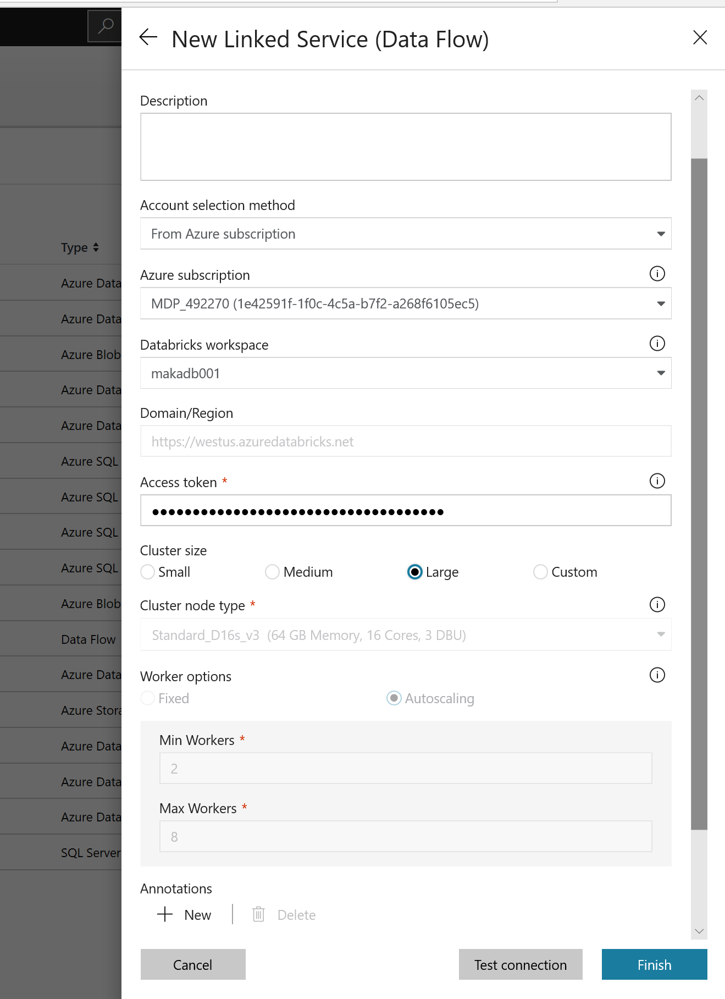
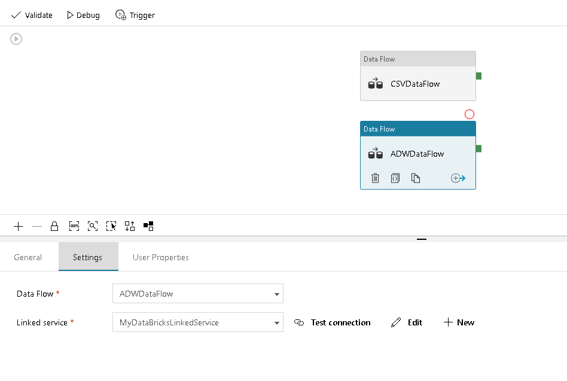

# ADF Data Flow Linked Services

Before you can begin debugging or executing your Data Flows, you must link to your Azure Databricks account.

There are 2 ways to connect Data Flow to your Azure Databricks account:

## Data Flow Linked Service

The ADF Data Flow Linked Service can take care of standing-up your Databricks cluster for you based on debug session (interactive cluster) or pipeline execution (job cluster). This type of Linked Service removes the need for you, as a Data Engineer, to choose Databricks configurations. Simply select Small, Medium or Large size for your execution environment.

Small would be appropriate for debug and testing, Medium for normal operationalized workloads and large to execute very large big data workloads. You can create separate Linked Services for each environment and then choose the appropriately-sized Linked Service based on your current workload.

There is also a custom size where you can then go through the size configurations manually, while still allowing ADF to pick the right type of cluster to execute based on debug (interactive cluster) or pipeline (job cluster) execution environment.

## Azure Databricks Linked Service

Click New to create the new Linked Service.

1. You must first create an Azure Databricks Workspace: https://docs.microsoft.com/en-us/azure/azure-databricks/quickstart-create-databricks-workspace-portal
2. In the Linked Service definition, either pick the Workspace from your Azure Subscription in the drop-down or manually enter the URL for the workspace
3. You will need to provide the access token key for your Azure Databricks account so that we can connect to your clusters for execution of your Data Flows

[Click here for more details on obtaining Azure Databricks access key tokens](https://docs.databricks.com/api/latest/authentication.html#generate-token)

4. Now you must select whether you wish to have ADF Data Flow automatically start-up a job cluster on every Data Flow execution, or do you want to re-use an existing cluster.
5. If you select "New job cluster", Data Flow will startup a new Databricks job cluster on each execution of your data flow. You will incur a spin-up wait time in the neighborhood of 5-7 minutes before your data flow will execute.
6. If you select "Existing Cluster", Data Flow will utilize your existing cluster. For this option, you will choose the Cluster Name from the list. This is the name you gave to your interactive cluster. In this case, you control the start/stop of your cluster to make it available for data flow.
7. When selecting "New job cluster", choose 4.1 for Cluster Version and Standard_DS4_v2 for Cluster Node type.
8. You can choose the min/max workers and Autoscaling based on your requirements.

**For designing, debugging Data Flows interactively, you must use the "Existing Cluster" option. This way, the cluster is already warm and Data Flows can execute immediately. For operationalized, scheduled pipelines with Data Flows, the "New Cluster" option will work fine because you won't be impacted by the 5-7 minute spin-up time for a new job cluster when you schedule your Data Flow jobs nightly**
