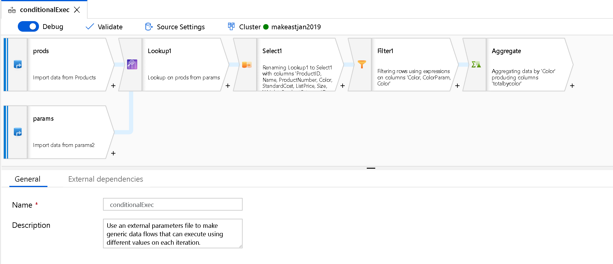
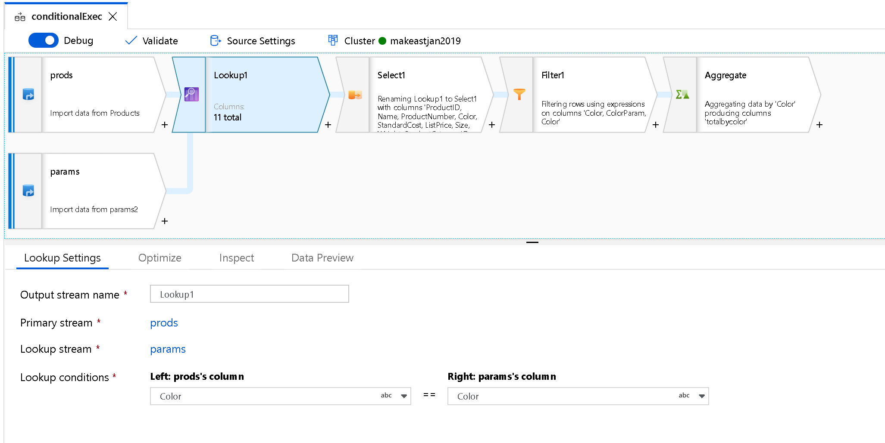
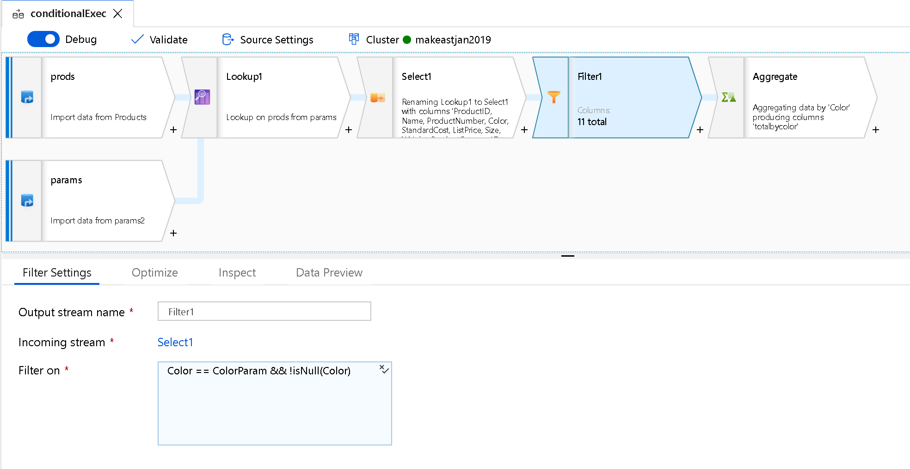
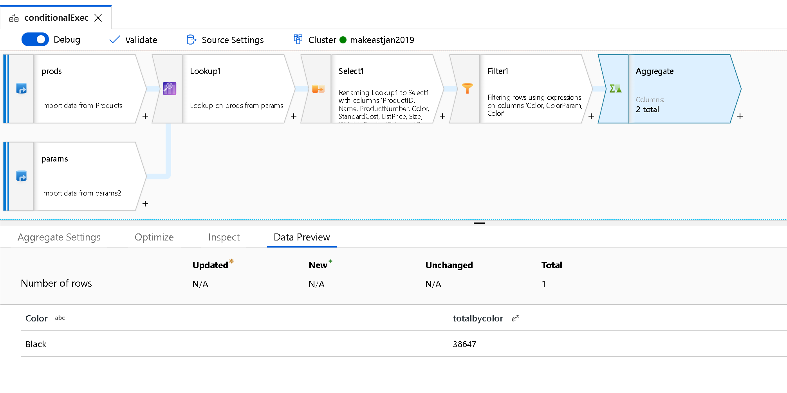

# Azure Data Factory Data Flow Concepts

## Parameter Files

You can use parameter files in ADF Data Flows in order to make your data flow more flexible and reusable. Use a text file or database table as the parameters container, lookup the parameter values with a Lookup transformation, and then use a Filter transformation to filter the rows that match the incoming value in the parameters file.

1. Add a 2nd source to your data flow, which will point to your file with parameter values

2. Use a Lookup transformation to join the main data stream with the lookup parameters file

3. Filter the rows using the Filter transformation. Match on the incoming params value to the matching column in the data source

4. Your data flow will now work against whichever values are found at the time of execution in your parameters file

