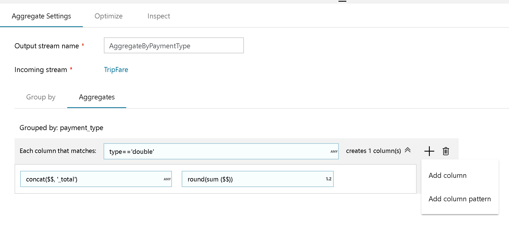

# Azure Data Factory Data Flow Concepts

## Parameter Files

You can use parameter files in ADF Data Flows in order to make your data flow more flexible and reusable.

This is very useful for handling Schema Drift scenarios or general scenarios where you are not able always fully know or assume each column name. You can pattern match on column name and column data type and build an expression for transformation that will perform that operation against any field in the data stream that matches your `name` & `type` patterns.

When adding an expression to a transform that accepts patterns instead of only exact field name matches, pick "Add Column Pattern" in order to utlize schema drift column matching patterns.

When building template column patterns, you can use `$$` in the expression to represent a reference to each matched field from the input data stream.

If you utilize one of the Expression Builder regex functions, you can then subsequently use $1, $2, $3 ... to reference the sub-patterns matched from your regex expression.

An example of using Column Patterns is to SUM a series of incoming fields for an Aggregate calculations in the Aggregate transformation. You can then SUM on every match of field types that match "integer" and then use $$ to reference each match in your expression.
