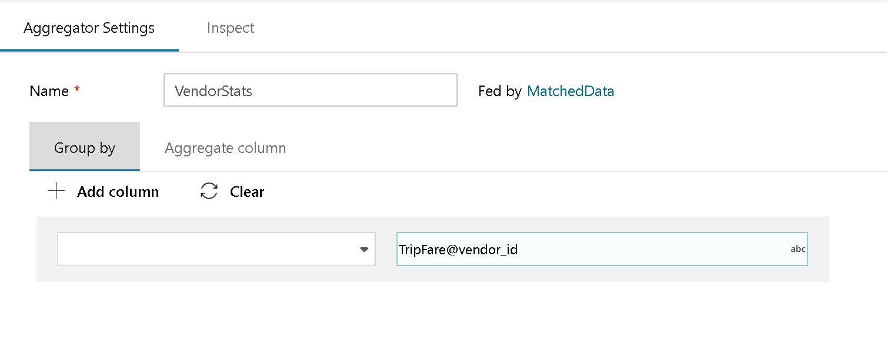

# Azure Data Factory Data Flow Transformations

## Aggregate

The Aggregate transformation is where you will define aggregations of columns in your data streams. In the Expression Builder, you can define different types of aggregations (i.e. SUM, MIN, MAX, COUNT, etc ...) and create a new field in your output that includes these aggregations with optional group-by fields.

### Options

#### Name and Fed-by

The first options you'll see in the Aggregator are the name you wish to use for the Aggregator and the "Fed by" link. This names the stream that is the link to this transform. You can move the transfom to another part of our Data Flow by clicking on the Fed By stream and selecting a different data stream.

#### Fail if columns in the dataset are not found
Choose this option to enforce a Source schema validation that will fail your Data Flow if columns that are expected from your source are not present.

#### Sampling
Use Sampling to limit the number of rows from your Source.  This is useful when you need just a sample of your source data for testing and debugging purposes.

### Define Schema

#### You can modify the name of the source columns and their associated data types
