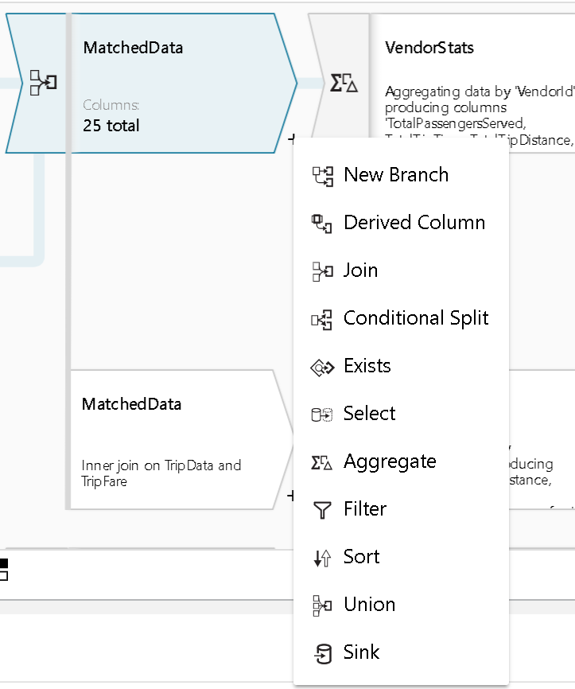
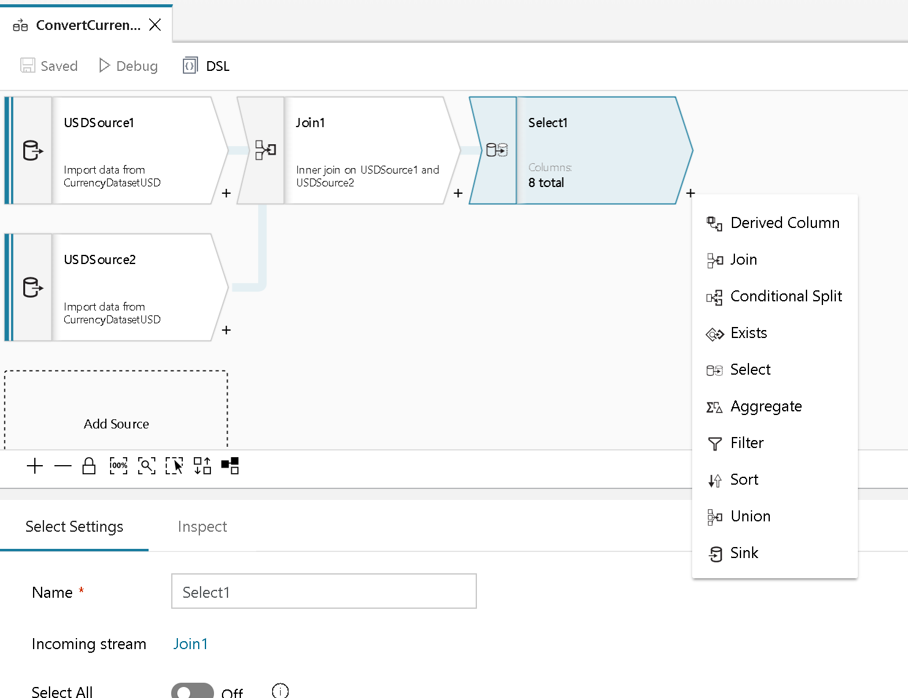

Branching will take the current data stream in your data flow and replicate it to another stream. This allows you to perform multiple sets of different operations and transformations against the same data stream.

Example: You have a Source Transform that includes a selected set of columns with data type conversions and then place a Derived Column immediately following that Source. In the Derived Column, you've create a nwe field that combines first name and last name to make a new "full name" field.

You can treat that new stream with a set of transformations and a sink on one row and use New Branch to create a copy of that stream to perform a completely different set of transformations and sink on another row.

** NOTE: "New Branch" will only show as an action on the + Transformation menu when there is a subsequent transformation following the current location where you are attempting to branch. i.e. You will not see a "New Branch" option at the end here until you add another transformation after the Select:

