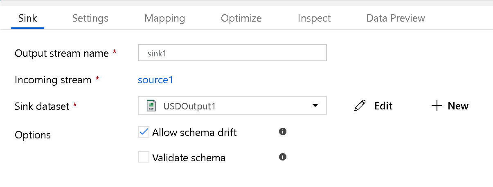

# Azure Data Factory Data Flow Transformations

## Sink

At the completion of your data flow transformation, you can sink your transformed data into a destination dataset. In the Sink transformation, you can choose the dataset definition that you wish to use for the destination output data.

A common practice to account for changing incoming data and to account for data drift is to sink the output data to a folder without a defined schema in the output dataset.

You can choose to overwrite, append, or fail the data flow when sinking to a dataset.

You can also choose "automap" to simply sink all incoming fields. If you wish to choose the fields that you want to sink to the destination, or if you would like to change the names of the fields at the destination, choose "Off" for "automap" and then click on the Mapping tab to map output fields:

** PLEASE NOTE: Not all Dataset properties in Blob and ADW are configured for use within Data Flow during the preview period. Currently, ADF supports both a straight-forward Copy Activity as well as data tranformation-based Data Flow capability, both of which utilize Datasets. All of the Dataset properties present today work with Copy Activity. The UI will try to notify you interactively of which properties are not recognized by Data Flow. We will updates these properties during each subsequent iteration of Data Flow. **

### Optional Azure SQL Data Warehouse Sink

We are releasing an early beta of the ADW Sink Dataset for Data Flow. This will allow you to land your transformed data directly into Azure SQL DW within Data Flow without the need of adding a Copy Activity in your pipeline.

Start by creating an ADW dataset, just as you would for any other ADF pipeline, with a Linked Service that includes your ADW credentials and choose the database that you wish to connect to.

