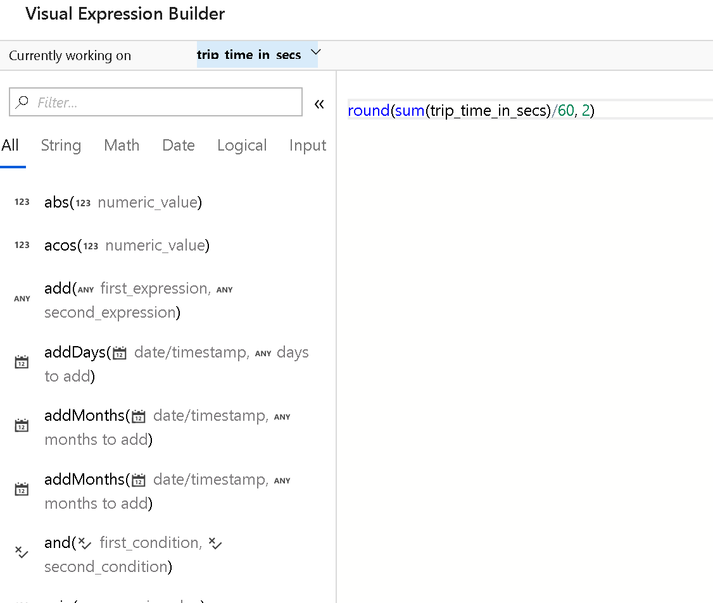

# Azure Data Factory Data Flow Transformations

## Expression Builder

In ADF Data Flow, you will find expression boxes where you can enter expressions for data transformation that utilizes columns, fields, variables, parameters, functions from your data flow. To build the expression, you use the Expression Builder, which can be launched by clicking in the expression text box within each transformation. You will also sometimes see "Computed Column" options when selecting columns for transformation. When you click that, you will also see the Expression Builder launched.



The Expression Builder tool defaults to the text editor option with auto-complete from the entire ADF Data Flow object model with syntax checking and highlighting.

## Currently Working on Field


At the top left of the Expression Builder UI, you will see a field called "Currently Working On" with the name of the field that you are currently working on. The expression that you build in the UI will be applied just to that currently working field. If you wish to transform another field, you can save your current work and use this drop-down to select another field and build an expression for the other fields.

## Comments

You can generate comments in your expressions using single line and multi-line comment syntax:


## Regular Expressions

The ADF Data Flow expression language, [full reference documentation here](https://docs.databricks.com/api/latest/authentication.html#generate-token), enables functions that include regular expression syntax. When using regular expression functions, the Expression Builder will try to interpret backslash (\) as an escape character sequence. So, when using backslashes in your regular expression, either enclose the entire regex in ticks ` ` or use a double backslash.

I.e. using ticks

```
regex_replace('100 and 200', `(\d+)`, 'digits')
```
or using double slash
```
regex_replace('100 and 200', '(\\d+)', 'digits')
```
