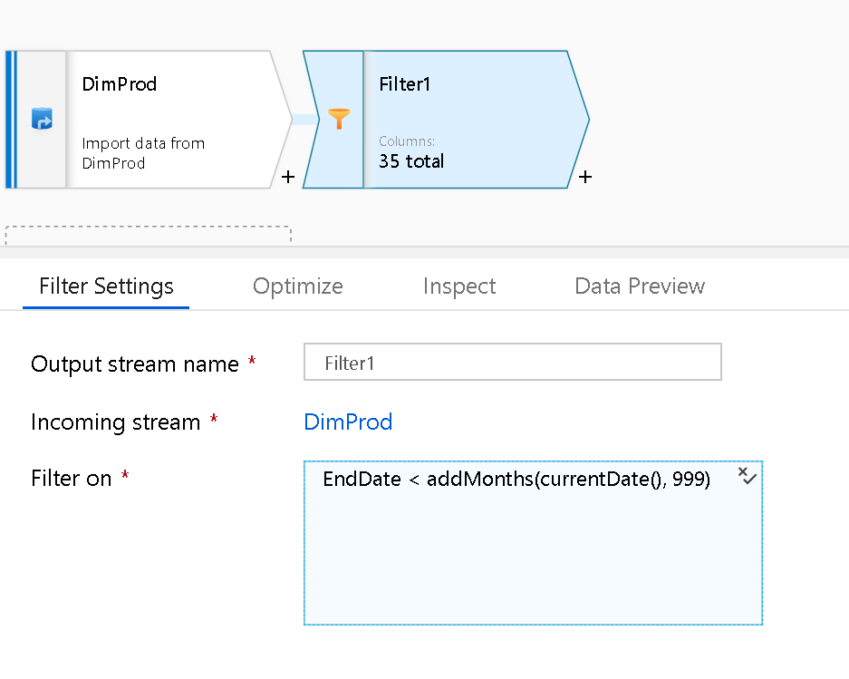

# Azure Data Factory Data Flow Transformations

## Filter

The Filter transforms is a row filtering transform that takes an expression as its parameter. Click in the text box to launch the Expression Builder. This is where you can build a filter expression which allows you to control which rows from the current data stream are allowed to pass through (filter) to the next transformation.



I.e. filter on loan_status column:

```
in([‘Default’, ‘Charged Off’, ‘Fully Paid’], loan_status).
```

Filter on the year column in the Movies demo:

```
year > 1980
```

## Tips for using Filter transform

The Filter transform can be very useful when used directly after a Source. You can use the Filter transform as the query predicate to a full table query from the source. ADF Data Flow is smart enough to take your end-to-end flows and optimize the execution utilizing pushdown techniques when available. So, using a Filter transform against what appears like a complete table scan in the design view may not actually execute as such when you attach your Data Flow to a pipeline. It is best to experiment with different techniques and use the Monitoring in ADF to gather timings and partition counts on your Data Flow activity executions.
