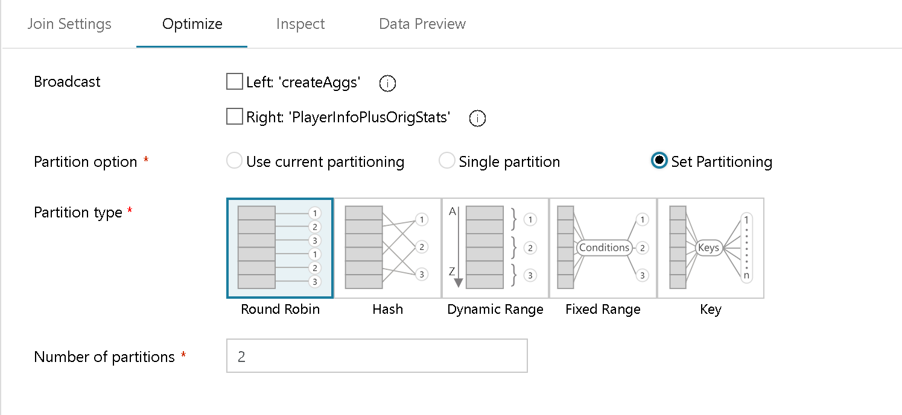
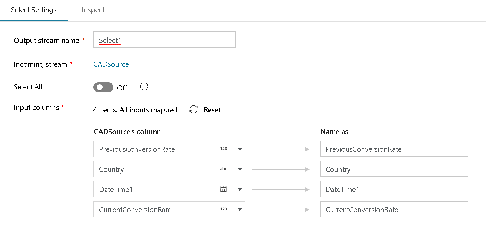

# Azure Data Factory Data Flow Transformations

## Join

Use Join to combine data from 2 tables in your Data Flow. Add the Join transform with the Plus icon on the data stream where you would like to join and then inside the transform you will select the 2nd Join stream.

### Join types

Selecting Join Type is required for the Join transformation

#### Inner Join

Inner join will pass through only rows that match the column conditions from from both tables

#### Left Outer

All rows from the left stream not meeting the join condition are passed through, and output columns from the other table are set to NULL in addition to all rows returned by the inner join.

#### Right Outer

All rows from the right stream not meeting the join condition are passed through, and output columns that correspond to the other table are set to NULL, in addition to all rows returned by the inner join.

#### Full Outer

Full Outer produces all columns and rows from both sides with NULL values for columns that are not present in the other table

#### Cross Join

Specific the cross product of the 2 streams with an expression

### Specify Join Conditions

The Left Join condition is from the data stream connected to the left of your Join. The Right Join condition is the second data stream connected to your Join on the bottom, which will either be a direct connector to another stream or a reference to another stream.

You are required to enter at least 1 (1..n) join conditions. They can be either directly-referenced fields selected from the drop-down menu, or expressions.

### Join Peformance Optimizations

Please note that unlike Merge Join in tools like SSIS, ADF's Join in Data Flow is not a mandatory merge join operation. Therefore, the join keys do not need to be sorted first. The Join operation will occur in Spark using Databricks based on the optimal join operation in Spark: Broadcast / Map-side join:

If your dataset can fit into the Databricks worker node memory, we can optimize your Join performance. You can also specify partitioning of your data on the Join operation to create sets of data that can fit better into memory per worker.

### Self-Join

You can achieve self-join conditions in ADF Data Flow by using the Select transformation to alias an existing stream. First, create a "New Branch" from a stream, then add a Select to alias the entire original stream.

In the above diagram, the Select transform is at the top. All it's doing is aliasing the original stream to "OrigSourceBatting". In the higlighted Join transform below it you can see that we use this Select alias stream as the right-hand join, allowing us to reference the same key in both the Left & Right side of the Inner Join.
