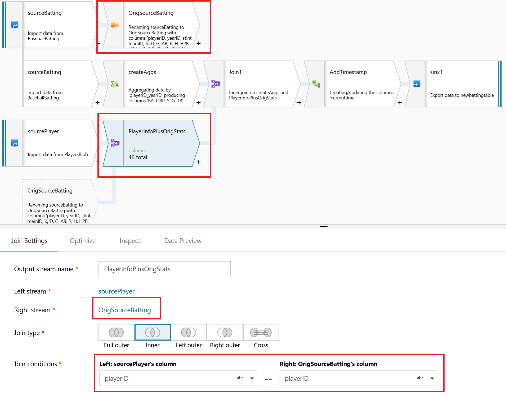

# Azure Data Factory Data Flow Transformations

## Select Transformation

Use this transformation for column selectivity (reducing number of columns) or to alias columns and stream names.

In ADF Data Flow, all of your columns will automatically propogate throughout your streams. As your columns accumulate, you can use the Select transform to "select" the columns that you wish to keep. You will see stream names appended to the column names to indicate the origins and lineage of those columns to help you make the proper determination.

While you can always choose column selectivity in the Sink transform at the end of your Data Flow, maintaining column hygiene may help you to prune your column lists. The downside to this approach is that you will lose that metadata downstream and will not be able to access it once you've dropped it from your metadata with a Select.

The Select transform allows you to alias an entire stream, or columns in that stream, assign different names (aliases) and then reference those new names later in your data flow. This is very useful for self-join scenarios. The way to implement a self-join in ADF Data Flow is to take a stream, branch it with "New Branch", then immediately afterward, add a "Select" transform. That stream will now have a new name that you can use to join back to the original stream, creating a self-join:

In the above diagram, the Select transform is at the top. All it's doing is aliasing the original stream to "OrigSourceBatting". In the higlighted Join transform below it you can see that we use this Select alias stream as the right-hand join, allowing us to reference the same key in both the Left & Right side of the Inner Join.

Select can also be used as a way de-select columns from your data flow. For example, if you have 6 columns defined in your sink, but you only wish to pick a specific 3 to transform and then flow to the sink, you can select just those 3 by using the select transform.

### NOTE: You must switch off Select All to pick only specific columns ###

## Options

The default setting for "Select" is to include all incoming columns and keep those original names. You can alias the stream by setting the name of the Select transform.

To alias individual columns, deselect "Select All" and use the column mapping at the bottom.

