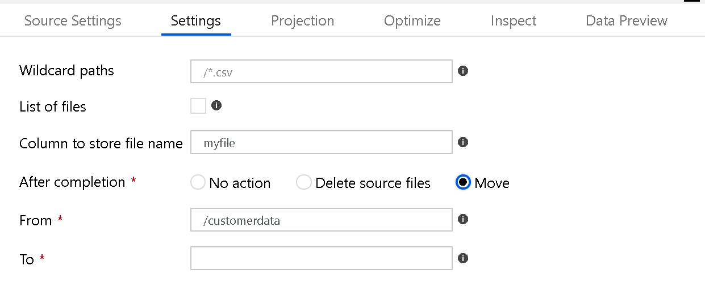
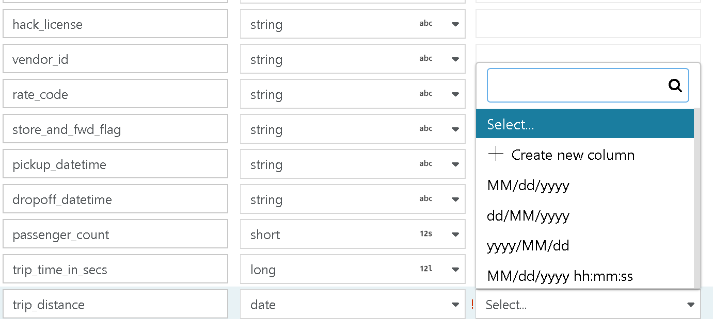
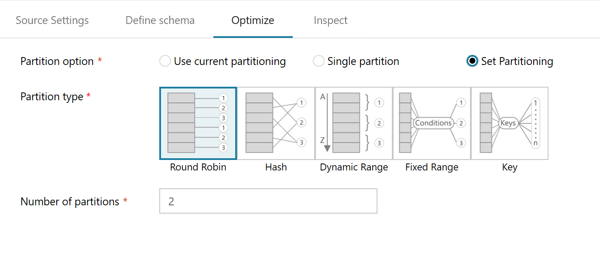

# Azure Data Factory Data Flow Transformations

## Source

The Source transformation configures a data source that you wish to use to bring data into your data flow. You may have more than 1 Source transform in a single Data Flow. This is where you will begin designing your Data Flows.

** NOTE: Every Data Flow requires at least 1 Source Transformation (i.e. 1 to n) **

Your Data Flow source must be associated with exactly 1 ADF Dataset, which defines the shape and location of your data to write to or read from.

### Data Flow Staging Areas

ADF Data Flow has line-of-sight to 5 primary "staging" areas within Azure to perform your data transformations: Azure Blob, ADLS Gen 1, ADLS Gen 2, Azure SQL DB and Azure SQL DW. ADF has access to nearly 80 different native connectors, so to include those other sources of data into your Data Flow, first stage that data into one of those 5 primary Data Flow staging areas first by using the Copy Activity:

* [ADF Data Flow: Staging Data](https://youtu.be/mZLKdyoL3Mo)

### Options

#### Allow schema drift
Select Allow Schema Drift if the source columns will change often. This setting will allow all incoming fields from your source to flow through the transformations to the Sink.

#### Fail if columns in the dataset are not found
Choose this option to enforce a Source schema validation that will fail your Data Flow if columns that are expected from your source are not present.

#### Sampling
Use Sampling to limit the number of rows from your Source.  This is useful when you need just a sample of your source data for testing and debugging purposes.

#### Define Schema

#### You can modify the name of the source columns and their associated data types

For source file types that are not strongly typed (i.e. flat files as opposed to Parquet files) you should define the data types for each field here in the Source transformation as opposed to in the Dataset.

If you do not see the column names and types in your Data Flow, it is likely because you did not define them in the Define Schema section of the Sink. You will only need to do this if you are not using Data Flow's Schema Drift handling.

Here in the "Define Schema" tab on the Source transformation is where you can set the data types and formats:

### Optimize

On the Optimize tab for the Source Transformation, you will see an additional paritioning type called "Source". This will only light-up when you have select Azure SQL DB as your source. This is because ADF will wish to parallelize connections to execute large queries against your Azure SQL DB source.

Partioning data on your SQL DB source is optional. You should use this for large queries. You have 2 options:

#### Column

Select a column to partition on from your source table. You must also set the max number of connections.

#### Query Condition

You can optionally choose to partition the connections based on a query. For this option, simply put in the contents of a WHERE predicate. I.e. year > 1980
