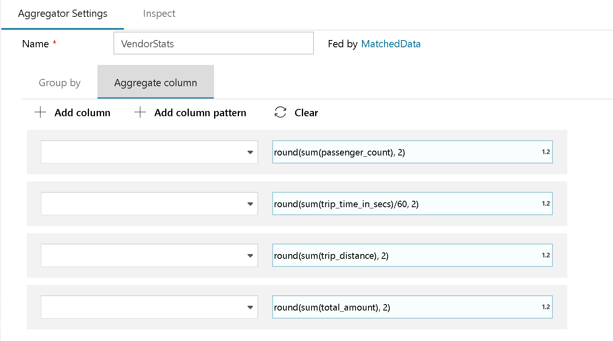

# Azure Data Factory Data Flow Transformations

## Window Aggregations

The Window transformation is where you will define window-based aggregations of columns in your data streams. In the Expression Builder, you can define different types of aggregations that are based on data or time windows (aka SQL OVER clause) such as LEAD, LAG, NTILE, CUMEDIST, RANK, etc ...) and create a new field in your output that includes these aggregations with optional group-by fields.

### Group By
(Optional) Choose a Group-by clause for your aggregation and use either the name of an existing column or a new name. Use "Add Column" add more group-by clauses and click on the text box next to the column name to launch the Expression Builder to either select just an existing column, combination of columns or expressions for your grouping.

### The Aggregate Column tab 
(Required) Choose the Aggregate Column tab to build the aggregation expressions. You can either choose an existing column to overwrite the value with the aggregation, or create a new field with the new name for the aggregation. The expression that you wish to use for the aggregation will be entered in the right-hand box next to the column name selector. Clicking on that text box will open up the Expression Builder.

Use the ADF Data Flow Expression Language to describe the column transformations in the Expression Builder: https://aka.ms/dataflowexpressions.

