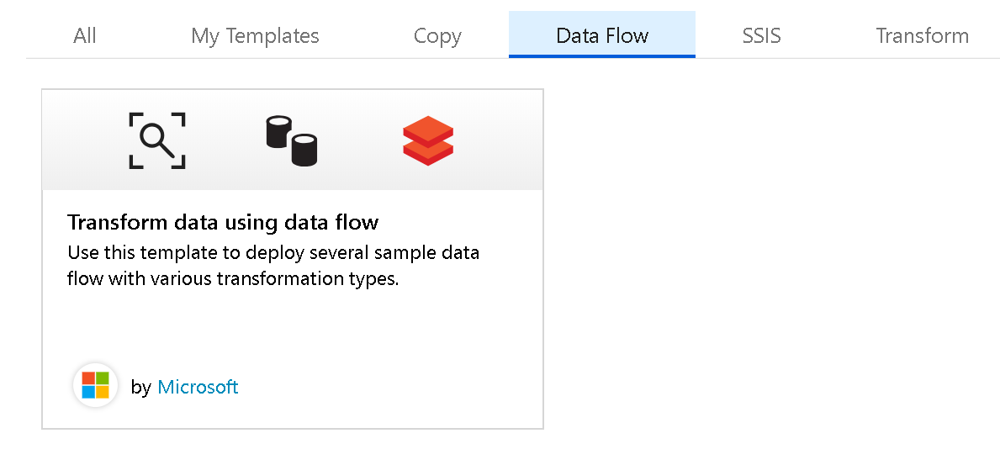

Get started with your first ADF Data Flow by first building a new Factory in the SE Asia region using the ARM Template in the Samples folder.

You can use PowerShell or the Azure Portal Template Deploymnet mechanism to build the factory from the ARM Template.

When filling-out the parameter fields for the ARM Template, you are only required to complete the Resource Group, FActory Name and Databricks fields. You can enter placeholder dummy values for Azure Databricks connectivity and correct those values later after you begin building your Data Flow.

The folder paths for the sample data can also be corrected later. For now, generate a Factory with these values and begin building your Data Flow.

You will see a series of sample Pipeleines, Datasets, Linked Services and Data Flows to get you started:

You will need to also confiure your Azure Databricks account before you can submit Data Flows for execution. First, build an Azure Databrick workspace and then grab the Access Token to enter into the ADF Linked Service for Azure Databricks. If you choose "create new cluster", ADF will spin-up a new job cluster for every execution of your data flow. You will incur approximtely 5 minutes of start-up time for the cluster to become ready. If you choose "existing cluster", you can control the start/stop actions on your own Azure Databricks cluster. Copy the cluster ID from your cluster and paste it in the Cluster ID field in the Linked Service.
